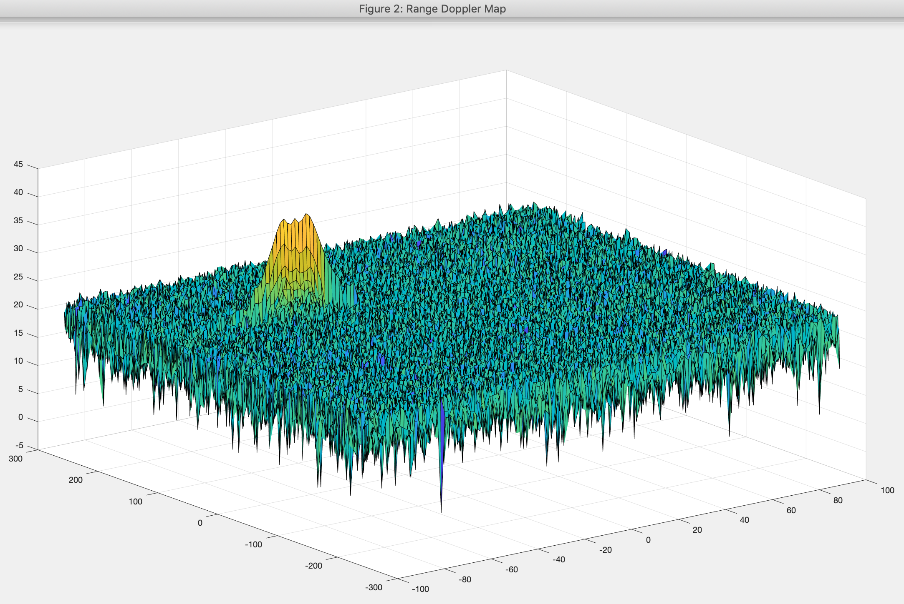

# Detecting targets using simulated radar measurements

## Steps

Designing wave

    d_res = 1;
    speed_of_light = 3*10^8;  % 3e8
    RMax = 200;

    Bsweep = speed_of_light / (2 * d_res);  % bandwidth
    Tchirp = 5.5 * 2 * RMax / speed_of_light; % chirp time
    alpha = Bsweep / Tchirp; % slope of FMCW chirps
    fc = 77e9;              % carrier frequency of radar 
                                                        
    Nd = 128;                % number of chirps in one sequence
    Nr = 1024;               % number of samples on each chirp    

    t = linspace(0, Nd * Tchirp, Nr * Nd); % total time for samples

    % vectors for Tx, Rx and Mix based on the total samples input
    Tx = zeros(1, length(t));    % transmitted signal
    Rx = zeros(1, length(t));    % received signal
    Mix = zeros(1, length(t));   % beat signal

    % vectors for range covered and time delay
    r_t = zeros(1, length(t));
    td = zeros(1, length(t));

    %% Signal generation and Moving Target simulation
    % Running the radar scenario over the time. 

    for i = 1:length(t)         
        % for each timestamp update the range of the target for constant velocity
        r_t(i) = d0 + v0 * t(i);
        td(i) = 2 * r_t(i) / speed_of_light;
        
        % for each time sample update the transmitted and received signal
        Tx(i) = cos(2 * pi * (fc * t(i) + alpha * t(i)^2 / 2));
        Rx(i) = cos(2 * pi * (fc * (t(i) - td(i)) + (alpha * (t(i) - td(i))^2) / 2));
        
        % now by mixing the transmit and receive generate the beat signal by performing
        % element-wise matrix multiplication of transmit and receiver signal
        Mix(i) = Tx(i) .* Rx(i);  % beat signal
    end

2D FFT

    %% RANGE

    % running the Fast Fourier Transform (FFT) on the beat signal along the range bins dimension (Nr) and normalise
    sig_fft = fft(Mix, Nr) ./ Nr;

    % taking absolute value of FFT output
    sig_fft = abs(sig_fft);       

    % output of FFT is double-sided signal, but since we are interested in one side of the spectrum only, we throw out half of the samples
    sig_fft = sig_fft(1 : (Nr / 2));

    %% VELOCITY

    Mix = reshape(Mix, [Nr, Nd]);

    % 2D FFT using the FFT size for both dimensions
    sig_fft2 = fft2(Mix, Nr, Nd);

    % taking just one side of signal from range dimension
    sig_fft2 = sig_fft2(1 : Nr / 2, 1 : Nd);
    sig_fft2 = fftshift(sig_fft2);
    RDM = abs(sig_fft2);
    RDM = 10*log10(RDM);

Selecting training, guard cells and offset

    % selecting number of training cells in both the dimensions by trial and error
    Tcr = 10;
    Tcd = 4;

    % selecting number of guard cells in both dimensions around the Cell Under Test (CUT) for accurate estimation
    Gcr = 5;
    Gcd = 2;

    % offsetting the threshold by signal-to-noise-ratio (SNR) value in dB
    offset = 1.4;

    % creating vector to store noise level for each iteration on training cells
    noise_level = zeros(Nr / 2 - 2 * (Tcd + Gcd), Nd - 2 * (Tcr + Gcr));
    gridSize = (2 * Tcr + 2 * Gcr + 1) * (2 * Tcd + 2 * Gcd + 1);
    trainingCellsNum = gridSize - (2 * Gcr + 1) * (2 * Gcd + 1);

Suppressing the non-thresholded cells at the edges

    Generating a thresholded block, which is smaller than the Range Doppler Map as the CUT cannot be located at the edges of matrix. Hence, few cells will not be thresholded. To keep the map size same set those values to 0

    CFAR_sig = zeros(size(RDM));

    % Using RDM[x,y] as the matrix from the output of 2D FFT for implementing CFAR
    for j = 1 : Nd - 2 * (Tcr + Gcr)
        for i = 1 : Nr / 2 - 2 * (Tcd + Gcd)

